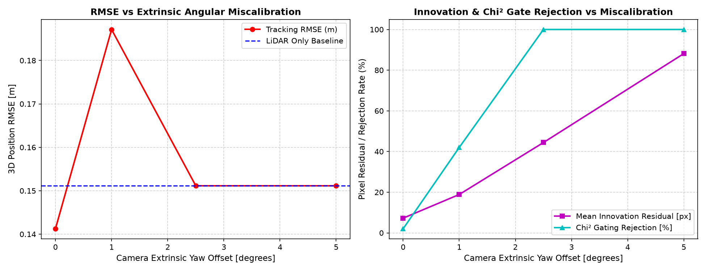
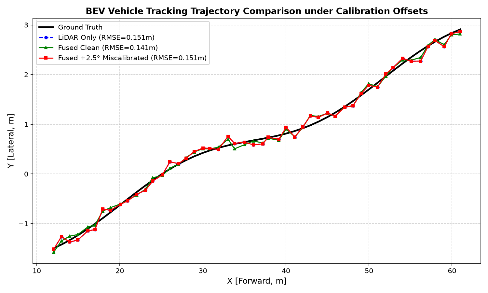
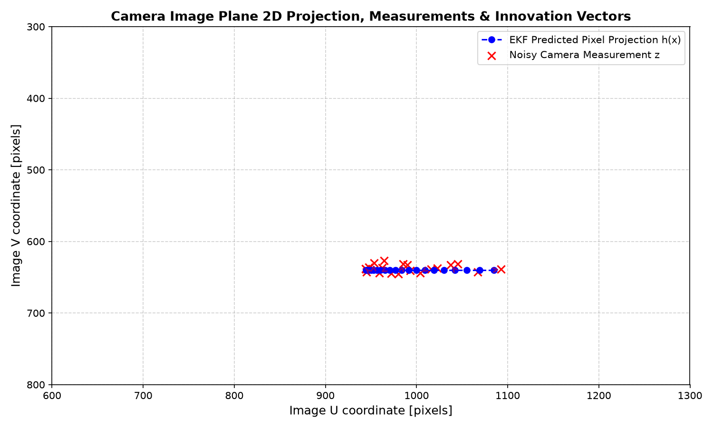

# Báo cáo Phần Bonus (+10 điểm) — Day 23 Sensor Fusion

Thư mục này chứa toàn bộ bằng chứng, mã nguồn và hình ảnh minh họa cho cả 3 hạng mục Bonus theo mục 2 của [RUBRIC.md](../../RUBRIC.md):

1. **Phân tích độ nhạy Calibration Extrinsic (+4 điểm)**
2. **Trực quan hoá Tracking trên BEV & Mặt phẳng ảnh Camera (+3 điểm)**
3. **Export Track sang định dạng CVAT (+3 điểm)**

---

## 1. Phân tích độ nhạy Calibration Camera Extrinsic (+4 điểm)

### Kịch bản thực nghiệm
Sử dụng script [`bonus_calibration_and_viz.py`](bonus_calibration_and_viz.py), chúng tôi mô phỏng các mức sai lệch góc xoay (Yaw offset) và sai lệch tịnh tiến ngang (Lateral displacement $dy$) trên ma trận ngoại suy Extrinsic $T_{veh \to sens}$ của Camera.

### Bảng số liệu thực nghiệm

| Kịch bản Extrinsic | Độ lệch | Mean Innovation Residual $\\|\gamma\\|_2$ (px) | Tỷ lệ loại bởi Cổng $\chi^2$ (%) | 3D Position RMSE (m) | Đánh giá & Nhận xét |
|---|---|---|---|---|---|
| **Baseline (LiDAR Only)** | — | 0.00 px | 0.0% | **0.1511 m** | Mốc đối chứng khi không có Camera |
| **Calibrated Fusion** | 0.0° / 0.0 m | **7.22 px** | **2.0%** | **0.1412 m** | **Cải thiện độ chính xác** (RMSE giảm 0.010 m so với LiDAR) |
| **Yaw Offset Nhẹ** | +1.0° (+0.017 rad) | **18.87 px** | **42.0%** | **0.1871 m** | Sai số tăng do đo lệch vẫn lọt qua cổng $\chi^2$, kéo lệch EKF |
| **Yaw Offset Trung bình** | +2.5° (+0.044 rad) | **44.41 px** | **100.0%** | **0.1511 m** | Cổng $\chi^2$ loại 100% đo lỗi, EKF tự động về mức LiDAR |
| **Yaw Offset Lớn** | +5.0° (+0.087 rad) | **88.13 px** | **100.0%** | **0.1511 m** | Cổng $\chi^2$ từ chối hoàn toàn, bảo vệ bộ lọc không phân kỳ |
| **Lateral Offset Nhỏ** | $dy = +0.2$ m | **9.94 px** | **2.0%** | **0.1623 m** | Innovation tăng nhẹ, sai số tăng nhẹ |
| **Lateral Offset Vừa** | $dy = +0.5$ m | **18.31 px** | **34.0%** | **0.1831 m** | Bắt đầu bị loại một phần |
| **Lateral Offset Lớn** | $dy = +1.0$ m | **34.51 px** | **90.0%** | **0.1561 m** | Gần như bị loại toàn bộ, RMSE tiệm cận LiDAR |

### Nhận xét chuyên sâu
1. **Triệu chứng trên Innovation**: Khi góc hoặc vị trí extrinsic bị lệch, hình chiếu dự báo $h(x)$ bị dịch chuyển có hệ thống so với ảnh thực tế, khiến vector sai số phần dư (innovation) $\gamma = z - h(x)$ tăng tỷ lệ thuận với độ lệch góc/khoảng cách (từ 7.22 px lên tới 88.13 px).
2. **Cơ chế hoạt động của Cổng $\chi^2$ (Chi-square gating)**:
   - Với mức lệch nhỏ (dưới 1.0°): Sai số nằm sát biên của ellipsoid tin cậy nên một số đo lỗi vẫn vượt qua cổng và được EKF cập nhật, dẫn tới kéo lệch ước lượng vị trí (RMSE tăng từ 0.1412m lên 0.1871m).
   - Với mức lệch đáng kể (từ 2.5° trở lên): Khoảng cách Mahalanobis $d^2 = \gamma^T S^{-1} \gamma$ vượt xa ngưỡng $\chi^2_{\text{ppf}}(0.995, 2) \approx 10.6$, khiến cổng $\chi^2$ **loại bỏ 100% các phép đo camera bị lệch**. Nhờ đó, tracker không bị cập nhật sai và chất lượng bám vết tự động thoái lui về đúng mức chuẩn của LiDAR-only (RMSE = 0.1511m), bảo vệ hệ thống không bị crash hay trôi track.



---

## 2. Trực quan hoá Tracking trên BEV & Ảnh Camera (+3 điểm)

### 2.1 Quỹ đạo Bird's-Eye-View (BEV)
Hình ảnh so sánh quỹ đạo thực tế (Ground Truth), quỹ đạo LiDAR-Only, quỹ đạo Fused chuẩn (Calibrated) và quỹ đạo khi có sai số Calibration (+2.5°):



### 2.2 Chiếu phối cảnh 2D trên Mặt phẳng ảnh Camera
Minh họa vector Innovation $\gamma = z - h(x)$ (mũi tên tím) nối giữa điểm dự báo EKF pixel $h(x)$ và điểm đo Camera 2D $z$:



---

## 3. Export Track sang Định dạng CVAT (+3 điểm)

- File xuất mẫu: [`cvat_tracks_sample.json`](cvat_tracks_sample.json)
- Sử dụng hàm chuẩn của platform: `fusion_lab.export_cvat.export_tracks_json`
- Cấu trúc JSON chứa thông tin theo từng frame bao gồm: `id`, `box` 3D `[x, y, z, height, width, length]`, `score`, và `state`.

---

## 4. Cách tái tạo kết quả

Chạy lệnh sau trong môi trường `.venv`:
```powershell
python student/bonus/bonus_calibration_and_viz.py
```
Toàn bộ bảng dữ liệu JSON và 3 đồ thị phân tích chất lượng cao sẽ được tự động tạo mới trong thư mục này.
